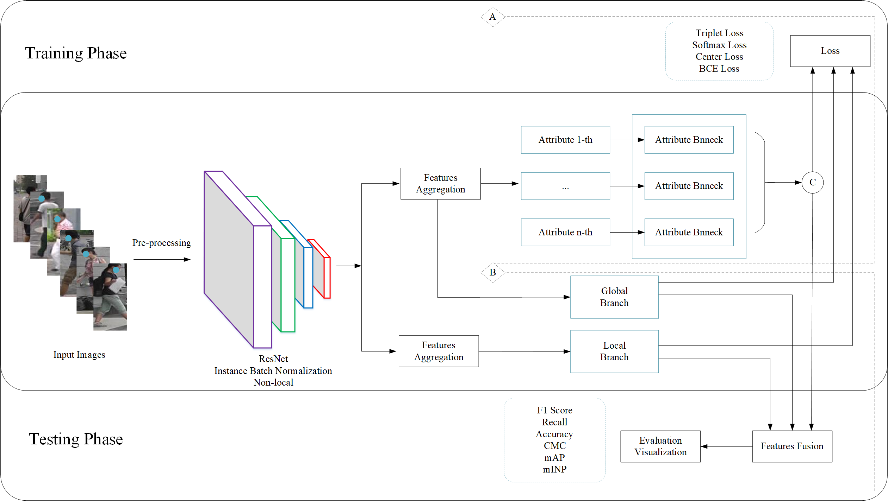
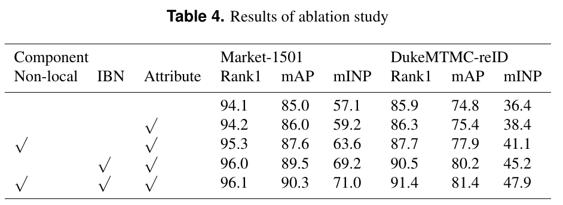

# Multi-level fusion model for person re-identification by attribute awareness
The official repository for Multi-level fusion model for person re-identification by attribute awareness

## Our unified framework

## Prepare Datasets
1.The Market1501 dataset is available from [Zheng](http://zheng-lab.cecs.anu.edu.au/Project/project_reid.html).

2.DukeMTMC-reID is available from [Zheng](https://megapixels.cc/duke_mtmc/).

L. Zheng, L. Shen, L. Tian, S. Wang, J. Wang, Q. Tian, Scalable person
re-identification: A benchmark, in: The IEEE International Conference
on Computer Vision, 2015, pp. 1116 – 1124.

Z. Zheng, L. Zheng, Y. Yang, Unlabeled samples generated by gan improve
the person re-identification baseline in vitro, in: The IEEE International
Conference on Computer Vision, 2017, pp. 3774 – 3782.

## Prepare ImageNet Pre-trained Models for IBN-Net
When training with the backbone of [IBN-Net](https://arxiv.org/abs/1807.09441), you need to download the ImageNet-pretrained model.

## Results

